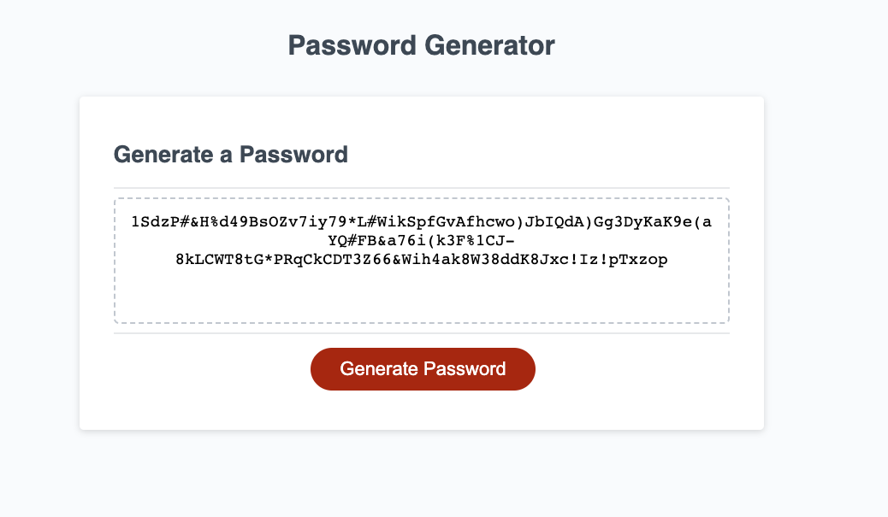

# password-generator

## Description 

For this project, I was able to utilize my newly learned javascript skills in order to prompt the user for password and output a customized password based on the user's criteria. This project took me a long time because I am still learning how javascript interacts with html elements. Try it out! It also corrects for invalid input, so try doing that aswell!
 

Here is the link to the deployed website: 
 
[Click Here for link](https://lopez-jordan.github.io/second-portfolio-project/)

## Credits

Credits to UC Berkeley Fullstack coding bootcamp repository:
 
[Click Here for link](https://github.com/coding-boot-camp/urban-octo-telegram)

© 2023 edX Boot Camps LLC. Confidential and Proprietary. All Rights Reserved.